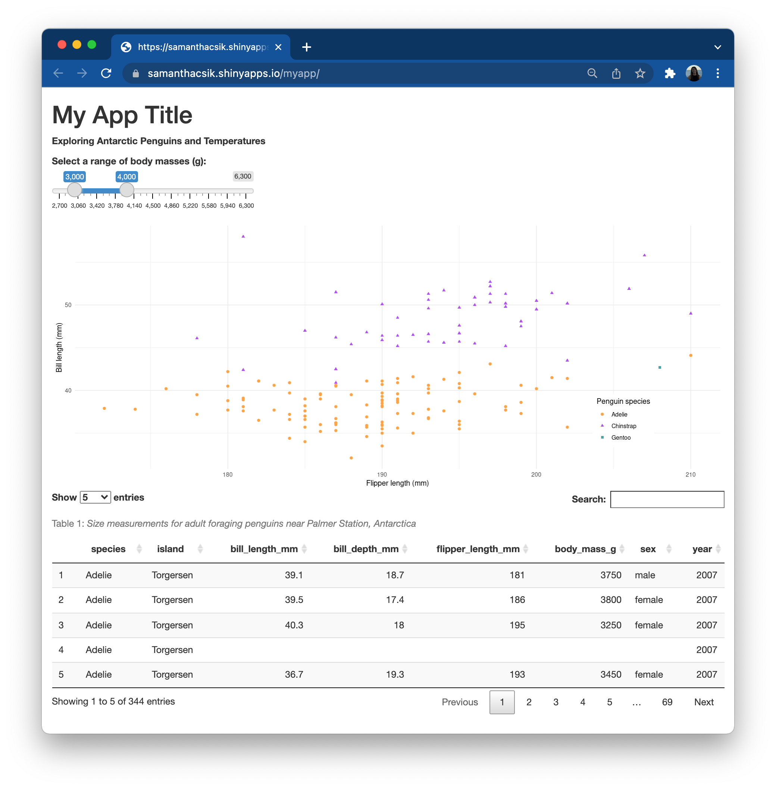
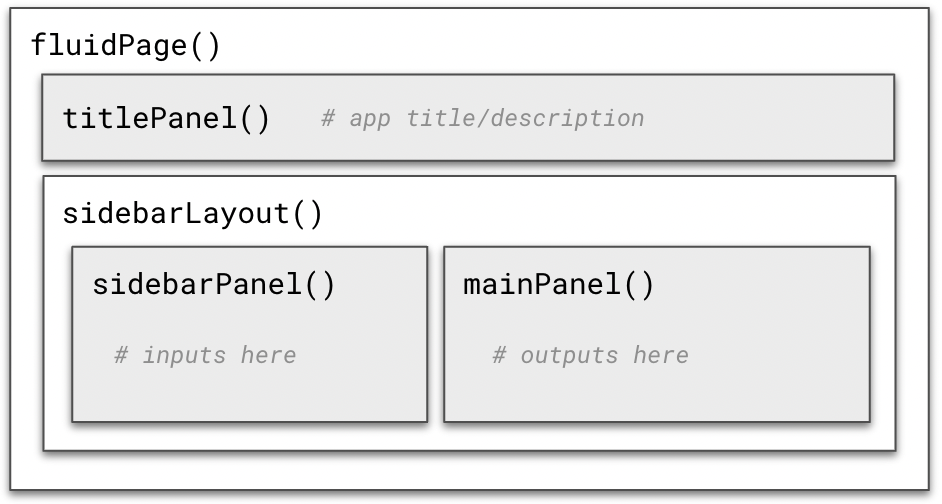
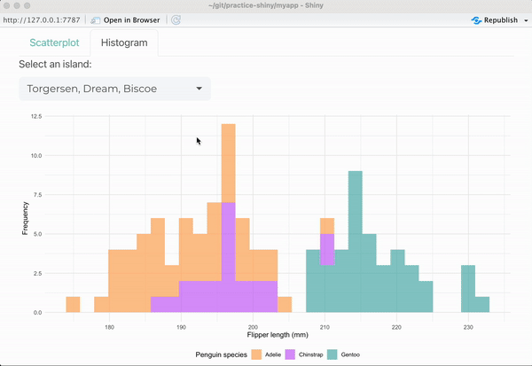

```{r setup, include=FALSE}
options(htmltools.dir.version = FALSE)
knitr::opts_chunk$set(
  fig.width = 9, fig.height = 3.5, fig.retina = 3,
  out.width = "100%",
  cache = FALSE,
  echo = TRUE,
  message = FALSE, 
  warning = FALSE,
  hiline = TRUE
)
```

```{r xaringan-themer, include = FALSE, warning = FALSE}
# load package
library(xaringanthemer)

# set accent theme
style_mono_accent(
  header_font_google = google_font("Nunito Sans"), # Sanchez
  text_font_google = google_font("Glacial Indifference", "300", "300i"),
  code_font_google = google_font("Fira Mono"),
  base_color = "#05859B",
  white_color = "#93C6C2", 
  background_color = "#FFFFFF",
  link_color = "#9b0546",
  text_bold_color = "#05859B",
  header_font_weight = 400,
  header_h1_font_size = "2.25rem",
  header_h2_font_size = "1.75rem",
  header_h3_font_size = "1.5rem",
  footnote_font_size = "0.7em",
)
```

class: inverse, middle

# An Intro to <br>

<br>

<span style = 'font-size: 130%;'>Sam Csik | Data Training Coordinator</span>  

National Center for Ecological Analysis & Synthesis<br>

<br>

<span style = 'font-size: 130%;'>Masters of Environmental Data Science | Winter 2022</span>   

Slides & source code available on [`r fontawesome::fa("github", fill = "#93C6C2", a11y = "sem")`](https://github.com/UCSB-MEDS/shiny-workshop)

---
### This workshop assumes the following:

<span style = 'font-size: 85%;'>`r fontawesome::fa("angle-right", fill = "#05859B", a11y = "sem")` You have R/RStudio installed on your machine and have a basic familiarity with the language.</span>  

<span style = 'font-size: 85%;'>`r fontawesome::fa("angle-right", fill = "#05859B", a11y = "sem")` You have git installed on your machine and have a GitHub profile. You should know how to create and clone a GitHub repository to your machine.</span>  

<span style = 'font-size: 85%;'>`r fontawesome::fa("angle-right", fill = "#05859B", a11y = "sem")` You have the required R packages installed. You can install/update them all at once by running:</span>  

```{r, echo = TRUE, eval = FALSE}
install.packages(c("shiny", "tidyverse", "palmerpenguins", "DT", "bslib", "thematic", "shinyWidgets"))
```

<span style = 'font-size: 85%;'>`r fontawesome::fa("angle-right", fill = "#05859B", a11y = "sem")` You have downloaded the Palmer weather time series data from the [EDI Data Portal](https://doi.org/10.6073/pasta/cddd3985350334b876cd7d6d1a5bc7bf) (`table_28.csv`)</span>

<span style = 'font-size: 85%;'>`r fontawesome::fa("angle-right", fill = "#05859B", a11y = "sem")` No prior Shiny experience is necessary!</span>  

.center[
```{r, out.width = '20%', out.height = '20%', echo = FALSE, fig.alt = "A blue hexagon with the word 'Shiny' in cursive lettering printed across the center."}
knitr::include_graphics("media/shiny.png")
```
]
---
### There are *lots* of really great Shiny resources out there

The following slides were adapted largely from existing materials, particularly: 

<span style = 'font-size: 85%;'>`r fontawesome::fa("angle-right", fill = "#05859B", a11y = "sem")` Garrett Grolemund's [Building Web Applications with Shiny](https://shiny.rstudio.com/tutorial/) tutorial (find the [GitHub Repo here](ttps://github.com/rstudio-education/shiny.rstudio.com-tutorial))</span>

<span style = 'font-size: 85%;'>`r fontawesome::fa("angle-right", fill = "#05859B", a11y = "sem")` Allison Horst's [The Basics of Building Shiny Apps in R](https://github.com/allisonhorst/shiny-basics-sb-r-ladies) workshop</span>

<span style = 'font-size: 85%;'>`r fontawesome::fa("angle-right", fill = "#05859B", a11y = "sem")` [Mastering Shiny](https://mastering-shiny.org/basic-app.html), by Hadley Wickham</span>

<span style = 'font-size: 85%;'>`r fontawesome::fa("angle-right", fill = "#05859B", a11y = "sem")` [Building Shiny apps - an interactive tutorial](https://deanattali.com/blog/building-shiny-apps-tutorial/), by Dean Attali</span>

<span style = 'font-size: 85%;'>`r fontawesome::fa("angle-right", fill = "#05859B", a11y = "sem")` [Engineering Production-Grade Shiny Apps](https://engineering-shiny.org/index.html), by Colin Fay, Sébastien Rochette, Vincent Guyader & Cervan Girard.</span>

Be sure to check out RStudio's great instructional resources and Shiny examples as well:

<span style = 'font-size: 85%;'>`r fontawesome::fa("angle-right", fill = "#05859B", a11y = "sem")` A thoughtfully organized [Articles](https://shiny.rstudio.com/articles/) page</span>

<span style = 'font-size: 85%;'>`r fontawesome::fa("angle-right", fill = "#05859B", a11y = "sem")` The [Shiny User Showcase](https://shiny.rstudio.com/gallery/#user-showcase), a collection of Shiny apps and their source code developed by the Shiny developer community -- many of these featured apps are winners or honorable mentions of the [annual Shiny contest](https://www.rstudio.com/blog/winners-of-the-3rd-annual-shiny-contest/)!</span>

<span style = 'font-size: 85%;'>`r fontawesome::fa("angle-right", fill = "#05859B", a11y = "sem")` [Shiny Demos](https://shiny.rstudio.com/gallery/#demos), a series of apps created by the Shiny developers to highlight specific features of the shiny package -- these are *excellent* resources to turn to when you are learning how to implement a new type of widget, working on the layout of your app, and more.</span>

---
class: inverse, middle, center

## `r fontawesome::fa("r-project", fill = "#93C6C2", a11y = "sem")` What is Shiny?

Think interactive web pages built by people who love to code in R (i.e. hopefully many of you!), no JavaScript experience necessary.

---
### Shiny makes building web applications easy

> *"**Shiny is an R package that makes it easy to build interactive web apps straight from R.** You can host standalone apps on a webpage or embed them in [R Markdown](https://rmarkdown.rstudio.com/?_ga=2.5356915.1997816511.1640293283-2019993402.1637352626) documents or build [dashboards](http://rstudio.github.io/shinydashboard/?_ga=2.5356915.1997816511.1640293283-2019993402.1637352626). You can also extend your Shiny apps with [CSS themes](http://rstudio.github.io/shinythemes/?_ga=2.94499804.1997816511.1640293283-2019993402.1637352626), [htmlwidgets](http://www.htmlwidgets.org/), and JavaScript [actions.](https://github.com/daattali/shinyjs/blob/master/README.md)"* - RStudio

<br>

.center[
```{r, out.width = '80%', out.height = '80%', echo = FALSE, fig.alt = "A gif of Andre Duarte's 'Worldbank-Shiny' app. On the lefthand side of the app, the title 'Gapminder Interactive Plot' sits above a series of three widgets. The first is a dropdown menu where the user can select a region (e.g. Europe & Central Asia) or view all regions at the same time. The next two widgets are slider inputs -- the first allows the user to select a year between 1960 and 2014, and the second allows the user to select a population size between 500 and 5000. On the right hand side of the app is a bubble plot of Fertility Rate vs. Life Expectancy, which updates as inputs are changed by the user. Hovering a bubble displays thge corresponding Country, Region, Population, Life Expectancy, and Fertility Rate."}
knitr::include_graphics("media/worldbank-shiny.gif")
```
.center[
<span style = 'font-size:80%;'>[Worldbank-Shiny](https://github.com/aguimaraesduarte/WorldBank-Shiny) app to visualize fertility rate vs. life expectancy from 1960 to 2015, by [Andre Duarte](https://github.com/aguimaraesduarte)</span>
]
]

---
class: inverse, middle, center

## `r fontawesome::fa("puzzle-piece", fill = "#93C6C2", a11y = "sem")` The anatomy of a Shiny app

What does a shiny app look like under the hood?

---
## The basic anatomy of a Shiny app

<span style = 'font-size:80%;'>Shiny apps are composed to *two parts*: (1) a **web page** that displays the app to a user (i.e. the **user interface**, or **UI** for short), and (2) a **computer** that powers the app (i.e. the **server**).</span>

.center[
```{r, out.width = '100%', out.height = '100%', echo = FALSE, fig.alt = ""}
knitr::include_graphics("media/basic_shiny_app.png")
```
]

<span style = 'font-size:80%;'>The **UI** controls the **layout and appearance** of your app and is written in HTML (except we use functions from the `{shiny}` package to write that HTML!). The **server** handles the **logic** of the app -- in other words, it is the set of instructions that tells the web page what to display when a user interacts with it.</span>
---
### Widgets are web elements that users can interact with via the UI

<span style = 'font-size:80%;'>Widgets collect information from the user which is then used to update outputs created in the server.</span>

.center[
```{r, out.width = '80%', out.height = '80%', echo = FALSE, fig.alt = "Examples of Shiny's pre-built widget options. These include buttons, single checkbox, checkbox groups, date input, date range, file input, numeric input, radio buttons, select box, sliders, and text input. The default color scheme is black and gray with selections highlighted in blue."}
knitr::include_graphics("media/basic_widgets.png")
```
]

<span style = 'font-size:80%;'>Shiny comes with a variety of [pre-built widgets](https://shiny.rstudio.com/tutorial/written-tutorial/lesson3/) (see above), but you can also explore widget extensions using the [{shinyWidgets}](https://github.com/dreamRs/shinyWidgets) package.</span>
---
### Reactivity - a very brief intro

<span style = 'font-size:80%;'>Reactivity is what makes Shiny apps responsive i.e. it lets the app instantly update itself whenever the user makes a change. At a very basic level, it looks something like this:</span>

.center[
```{r, out.width = '90%', out.height = '90%', echo = FALSE, fig.alt = "A schematic of Shiny reactivity. The UI is represented by a light blue box. Inside the blue UI box, there is a radio button widget that says, 'Make a choice:' and three round radio buttons beneath it. Underneath that, there is a placeholder space for a reactive output to be created by the server. The server is to the left of the UI and is represented by an orange box. At a basic level, reactivity occurs after the following steps: (1) A widget gets information from a user which (2) is then passed to the server where it is used to update a data frame based on the users choice. (3) The new data frame is used to update outputs in the server, and (4) those outputs are then rendered in the UI."}
knitr::include_graphics("media/reactivity_intro.png")
```
]

<span style = 'font-size:80%;'>Check out Garrett Grolemund's article, [How to understand reactivity in R](https://shiny.rstudio.com/articles/understanding-reactivity.html) for a more detailed overview of Shiny reactivity.</span>

---
class: inverse, middle, center

## `r fontawesome::fa("laptop-code", fill = "#93C6C2", a11y = "sem")` Can I see an example with code please?

I'm glad you asked!

---
### <span style = 'font-size:90%;'>The Shiny package comes with **11** built-in examples to explore</span>

<span style = 'font-size:65%;'>Install (if you have not yet done so) the `{shiny}` package by running the following code in your console:</span>
```{r install shiny, eval = FALSE}
install.packages("shiny")
```

<span style = 'font-size:65%;'>Check out the available Shiny app examples by running this code in your console:</span>
```{r shiny built-in example 1, eval = TRUE}
library(shiny)
runExample(example = NA)
```

<span style = 'font-size:65%;'>Run the first example, which plots R’s built-in `faithful` data set with a configurable number of bins:</span>
```{r, eval = FALSE}
runExample("01_hello")
```

.footnote[
<span style = 'font-size:65%;'>Check out [The basic parts of a Shiny app](https://shiny.rstudio.com/articles/basics.html) article, by Shiny from RStudio for an overview of some additional examples.</span>
]

--

<span style = 'font-size:65%;'>Change the number of bins using the `sliderInput` widget and watch the histogram re-render. These working examples also come paired with source code for you to see how the application is built. For example, the `sliderInput` is built with the following code:</span>

```{r, eval = FALSE, echo = TRUE}
# Input: Slider for the number of bins ----
sliderInput(inputId = "bins",
            label = "Number of bins:",
             min = 1,
             max = 50,
             value = 30)
```

---
class: inverse, middle, center

## `r fontawesome::fa("play", fill = "#93C6C2", a11y = "sem")` Creating your first Shiny app

Before we get started, make sure to set up a GitHub repository and R project to house our soon-to-be Shiny app. Doesn't matter what you call it--I'll call mine something like, "practice-shiny".

---
### The data

<span style = 'font-size:70%;'>We'll be using two different data sets to create our Shiny app: **(1)** the `penguins` data set from the [`{palmerpenguins}`](https://allisonhorst.github.io/palmerpenguins/) package and **(2)** the [Palmer Station Weather - Daily Averages](https://portal.edirepository.org/nis/mapbrowse?packageid=knb-lter-pal.28.8) dataset from the Palmer Station Antarctic LTER.</span>

<span style = 'font-size:70%;'>To access the **penguin** data set, you need to install and load the `{palmerpenguins}` package into R. Type `View(penguins)` into your console to open the data frame in the viewer. Type `?penguins` into your console to pull up additional information (including metadata) in the Help window of RStudio.</span>

<span style = 'font-size:70%;'>Download the Palmer weather time series data (`table_28.csv`) and view its metadata on the [EDI Data Portal](https://doi.org/10.6073/pasta/cddd3985350334b876cd7d6d1a5bc7bf). Alternatively, you can download the file from [Google Drive](https://drive.google.com/file/d/1du5KHtDt_zzgBKAFxNYtdEAzfp7bfuGm/view?usp=sharing).</span>

.center[
```{r, out.width = '25%', out.height = '25%', echo = FALSE, fig.alt = "Three penguins standing in a row. The first is a chinstrap penguin, facing to the right so that we see its body and face profile. It has a black head, back, top of wings wings, and bill, but a white face, chin, belly, underside of wings, and light pink feet. A thin black line runs under its chin, looking similar to a chinstrap. It is standing in front of a purple background. The second is a Gentoo peguin facing towards us with its wings spread out to the side. It has a black face, back, and top of its wings, but a white belly, underside of wings, and wide white stripes above each eye that extend over the top of its head, like a bonnet. It has a bright orange bill and feet. It is standing in front of a green background. The third is an Adélie penguin with its body facing towards us but its head turned to the left so that we see its face profile. It has a completely black head, bill, back, and top of its wings. It has a white belly, underside of its wings, and thin white circles around its eyes, in addition to light pink feet. It is standing in front of an orange background."}
knitr::include_graphics("media/lter_penguins.png")
```
.center[
<span style = 'font-size:40%;'>Artwork by [@allison_horst](https://twitter.com/allison_horst?ref_src=twsrc%5Egoogle%7Ctwcamp%5Eserp%7Ctwgr%5Eauthor)</span>
]
]

.footnote[
<span style = 'font-size:80%;'>**Citations:**</span>

<span style = 'font-size:70%;'>**(1)** Horst AM, Hill AP, Gorman KB (2020). palmerpenguins: Palmer Archipelago (Antarctica) penguin data. R package version 0.1.0. https://allisonhorst.github.io/palmerpenguins/. doi:10.5281/zenodo.3960x218.</span>   

<span style = 'font-size:70%;'>**(2)** Palmer Station Antarctica LTER and P. Information Manager. 2019. Daily averaged weather timeseries (air temperature, pressure, wind speed, wind direction, precipitation, sky cover) at Palmer Station, Antarctica combining manual observations (1989 - Dec 12, 2003) and PALMOS automatic weather station measurements (Dec 13, 2003 - March 2019). ver 8. Environmental Data Initiative. https://doi.org/10.6073/pasta/cddd3985350334b876cd7d6d1a5bc7bf (Accessed 2021-12-29).</span>
]

---
### What to expect:

<span style = 'font-size:70%;'>We will start by building and publishing a very basic shiny app using `{palmerpenguins}` data that includes:</span>

* <span style = 'font-size:70%;'>a title and subtitle</span>
* <span style = 'font-size:70%;'>a `sliderInput` to render a reactive scatterplot output</span>
* <span style = 'font-size:70%;'>an interactive `DT` table (**Exercise 1**)</span>

--

<span style = 'font-size:70%;'>Next, we will learn how to spruce up the appearance of our app by:</span>

* <span style = 'font-size:70%;'>using layout functions to outline the visual structure of our app (**Exercise 2**)</span>
* <span style = 'font-size:70%;'>add our text & widgets back into our app (**Exercise 3**)</span>
* <span style = 'font-size:70%;'>apply a theme using the `{bslib}` package</span>
* <span style = 'font-size:70%;'>republish our updated app to [shinyapps.io](https://www.shinyapps.io/)</span>

--

<span style = 'font-size:70%;'>We will then practice adding another reactive widget using `{palmerpenguins}` data that includes:</span>

* <span style = 'font-size:70%;'>a `pickerInput` (from the `{shinyWidgets}` package) to render a reactive histogram output (**Exercise 4**)</span>
* <span style = 'font-size:70%;'>writing a user-friendly error message for our UI</span>
* <span style = 'font-size:70%;'>adding a second `sliderInput` to our reactive histogram output (**Exercise 5**)</span>

---
### What to expect:

<span style = 'font-size:70%;color:#000000;'>We will start by building and publishing a very basic shiny app using `{palmerpenguins}` data that includes:</span>

* <span style = 'font-size:70%;color:#000000;'>a title and subtitle</span>
* <span style = 'font-size:70%;color:#000000;'>a `sliderInput` to render a reactive scatterplot output</span>
* <span style = 'font-size:70%;color:#000000;'>an interactive `DT` table (**Exercise 1**)</span>

<span style = 'font-size:70%;color:#c9c6c5;'>Next, we will learn how to spruce up the appearance of our app by:</span>

* <span style = 'font-size:70%;color:#c9c6c5;'>using layout functions to outline the visual structure of our app (**Exercise 2**)</span>
* <span style = 'font-size:70%;color:#c9c6c5;'>add our text & widgets back into our app (**Exercise 3**)</span>
* <span style = 'font-size:70%;color:#c9c6c5;'>apply a theme using the `{bslib}` package</span>
* <span style = 'font-size:70%;color:#c9c6c5;'>republish our updated app to [shinyapps.io](https://www.shinyapps.io/)</span>

<span style = 'font-size:70%;color:#c9c6c5;'>We will then practice adding another reactive widget using `{palmerpenguins}` data that includes:</span>

* <span style = 'font-size:70%;color:#c9c6c5;'>a `pickerInput` (from the `{shinyWidgets}` package) to render a reactive histogram output (**Exercise 4**)</span>
* <span style = 'font-size:70%;color:#c9c6c5;'>writing a user-friendly error message for our UI</span>
* <span style = 'font-size:70%;color:#c9c6c5;'>adding a second `sliderInput` to our reactive histogram output (**Exercise 5**)</span>

---
### All Shiny apps begin the same way

<span style = 'font-size:80%;'>You can create your app using RStudio's built-in Shiny app template (e.g. File > New Project... > New Directory > Shiny Application), but it's just as easy to create it from scratch (and you'll memorize the structure faster!). Let's do that now.</span>

--

<span style = 'font-size:80%;'>Create a new R script and name it `app.R` -- you **must** name your script `app.R`, otherwise it will not be recognized as a Shiny app. Copy the following code into your `app.R` script, or use the `shinyapp` snippet to automatically generate a shiny app template.</span>

```{r, echo = TRUE, eval = FALSE}
# load packages ----
library(shiny)

# user interface ----
ui <- fluidPage()

# server instructions ----
server <- function(input, output) {}

# run the application ----
shinyApp(ui = ui, server = server)
```

<span style = 'font-size:80%;'>It's best practice to place this `app.R` file into its own folder and *not* in a folder that contains other scripts/files, *unless* those other files are used by your app. This is a good segue into talking about repository files structure...</span>

.footnote[
<span style = 'font-size:80%;'>**Tip:** Use code sections (denoted by `# some text ----`) to make navigating different sections of your application code a bit easier. Code sections will appear in your document outline (find the button at the top right corner of the script/editor panel or use the `shift` + `command/control` + `O` keyboard shortcut).</span>
]

---
## Shiny app repository structure

COME BACK TO THIS PAGE 

```
my-app
|_myapp # make sure the name of this directory is at least 4 characters long
  |_app.R
  |_processed_data
    |_my_data.csv
  |_functions.R
  |_www
    |_my_img.png
|_raw_data
  |_raw_data.csv
  
```
---
## Run your app

<span style = 'font-size:75%;'>Once you have saved your `app.R` file, the "Run" code button should turn into a "Run App" button that looks like:</span>  <span style = 'font-size:75%;'>Click that button to run your app!</span>

<span style = 'font-size:75%;'>You won't see much yet, as we have only built a blank app (but a functioning app, nonetheless!). In your RStudio console, you should see something like: `Listening on http://127.0.0.1:XXXX`, which is the URL where your app can be found. 127.0.0.1 is a standard address that means "this computer," and the last four digits represent a randomly assigned port number.</span>

<span style = 'font-size:75%;'>You should also notice a red stop sign, , appear in the top right corner of your console indicating that R is busy--this is because your R session is currently acting as your Shiny app server and listening for any user interaction with your app. Because of this, you won't be able to run any commands in the console until you quit your app. Do so by pressing the stop button.</span>

.pull-left[
```{r, out.width = '85%', out.height = '85%', echo = FALSE, fig.alt = ""}
knitr::include_graphics("media/blank_app.png")
```
]

.pull-right[
```{r, out.width = '85%', out.height = '85%', echo = FALSE, fig.alt = ""}

```
]

---
## An alternative: two-file Shiny apps

<span style = 'font-size:75%;'>While we'll be building both our UI and our server within the same `app.R` file, you may choose to split these into two separate files called `ui.R` and `server.R`. Separating the UI and server can make it easier to navigate and manage code for larger, more complex applications. Note that when splitting your UI and server into separate files, you do not need to include the `shinyApp(ui = ui, server = server)` line of code. </span>

.pull-left[
```{r, echo = TRUE, eval = FALSE}
library(shiny)

# app.R
ui <- fluidPage(
  sliderInput(inputId = "num",
              label = "Choose a number", 
              value = 25, min = 1, max = 100),
  plotOutput("hist")
)


server <- function(input, output) {
  output$hist <- renderPlot({
    hist(rnorm(input$num))
  })
}


shinyApp(ui = ui, server = server)
```
]

.pull-right[
```{r, echo = TRUE, eval = FALSE}
library(shiny)

# ui.R
ui <- fluidPage(
  sliderInput(inputId = "num",
              label = "Choose a number", 
              value = 25, min = 1, max = 100),
  plotOutput("hist")
)
```

```{r, echo = TRUE, eval = FALSE}
library(shiny)

# server.R
server <- function(input, output) {
  output$hist <- renderPlot({
    hist(rnorm(input$num))
  })
}
```
]

.footnote[
<span style = 'font-size:80%;'>**PRACTICE:** Create a blank, two-file shiny app **in a new directory** (i.e. folder) and run the app. You can do so by clicking the "Run App" button from either the `ui.R` or `server.R` file, or run the command, `runApp("<your_directory_name>")` in the console (this also works for running your single `app.R` file).</span>
]

---
class: inverse, middle, center

## `r fontawesome::fa("tools", fill = "#93C6C2", a11y = "sem")` Building out your Shiny app

Here, we'll add our first reactive object to our app and establish a general Shiny coding workflow.

---
### Let's first add some text to our app

<span style = 'font-size:80%;'>We'll do this in the **UI** within `fluidPage()`, a layout function that sets up the basic visual structure of the page and scales components in real time to fill all available browser width. Add a title and subtitle to your app (*be sure to separate each with a comma, `,`*), save, and run:</span>

```{r, eval = FALSE}
# user interface ----
ui <- fluidPage(
  
  # app title ----
  "My App Title",
  
  # app subtitle ----
  "Exploring Antarctic Penguins and Temperatures"
  
  )
```

--

<span style = 'font-size:80%;'>Recall that the UI is actually just an HTML document. We can add static HTML elements using [tags](https://shiny.rstudio.com/articles/tag-glossary.html), a list of functions that parallel common HTML tages (e.g. `tags$h1()`) The most common tags also have wrapper functions (e.g. `h1()`). We can use some of these tags to spruce up our text:</span>

```{r, eval = FALSE}
# user interface ----
ui <- fluidPage(
  
  # app title ----
  tags$h1("My App Title"),
  
  # app subtitle ----
  p(strong("Exploring Antarctic Penguins and Temperatures"))
  
  )
```

---
### Adding inputs and outputs

<span style = 'font-size:80%;'>Next, we will begin to add some inputs and outputs to our `fluidPage()` (anything that you put into `fluidPage()` will end up in our app...and we want inputs and outputs in our app!).</span>

<span style = 'font-size:80%;'>**Inputs** are the things that users can interact with (e.g. toggle, slide) and provide values to your app. The Input functions below correspond to the widgets you see on [slide #8](https://ucsb-meds.github.io/shiny-workshop/#8). **Outputs** are the R objects that your user sees (e.g. tables, plots) and are what respond when a user interacts with/changes an input value.</span>

.pull-left[
**[Inputs functions:](https://mastering-shiny.org/basic-ui.html#inputs)**  
* <span style = 'font-size:80%;'>`actionButton()`</span>
* <span style = 'font-size:80%;'> `actionLink()`</span>
* <span style = 'font-size:80%;'>`checkboxInput()`</span>  
* <span style = 'font-size:80%;'>`checkboxGroupInput()`</span>
* <span style = 'font-size:80%;'>`dateInput()`</span>
* <span style = 'font-size:80%;'>`dateRangeInput()`</span>
* <span style = 'font-size:80%;'>`fileInput()`</span>
* <span style = 'font-size:80%;'>`numericInput()`</span>
* <span style = 'font-size:80%;'>`passwordInput()`</span>
* <span style = 'font-size:80%;'>`radioButtons()`</span>
* <span style = 'font-size:80%;'>`selectInput()`</span>
* <span style = 'font-size:80%;'>`sliderInput()`</span>
* <span style = 'font-size:80%;'>`submitButton()`</span> 
* <span style = 'font-size:80%;'>`textInput()`</span>
]

.pull-right[
**[Output functions:](https://mastering-shiny.org/basic-ui.html#outputs)**
* <span style = 'font-size:80%;'>`dataTableOutput()` (inserts an interactive table)</span>
* <span style = 'font-size:80%;'>`imageOutput()`(inserts an image)</span>
* <span style = 'font-size:80%;'>`plotOutput()` (inserts a plot)</span>
* <span style = 'font-size:80%;'>`verbatimTextOutput()` (inserts text)</span>
* <span style = 'font-size:80%;'>`tableOutput()` (inserts a table)</span>
* <span style = 'font-size:80%;'>`textOutput()` (inserts text)</span>
* <span style = 'font-size:80%;'>`uiOutput()` (inserts a Shiny UI element)</span>
* <span style = 'font-size:80%;'>There are also additional specialized `*Output()` functions, like [`plotlyOutput()`](https://www.rdocumentation.org/packages/plotly/versions/4.9.4.1/topics/plotly-shiny) and [`DTOutput()`](https://rstudio.github.io/DT/shiny.html)</span>
]

---
### Where we're going...

<span style = 'font-size:80%;'>We're going to create a **scatterplot of penguin bill lengths vs. penguin flipper lengths** using the `penguins` data set from the `{palmerpenguins}` package. We'll make this scatterplot *reactive* by adding a `sliderInput` that allows a user to filter the displayed data points by **selecting a range of penguin body masses** (e.g. only plot bill and flipper lengths for penguins with body masses ranging from 4,500 grams to 6,000 grams).</span>

.pull-left[
<span style = 'font-size:80%;'>**To create a reactive output, we will follow these steps:**</span>

<span style = 'font-size:70%;'>**1.** Add an input (e.g. `sliderInput`) to the UI that users can interact with</span>  

<span style = 'font-size:70%;'>**2.** Add an output (e.g. `plotOutput`) to the UI that creates a *placeholder space* to fill with our eventual reactive output</span>  

<span style = 'font-size:70%;'>**3.** Tell the server how to assemble inputs into outputs</span>  
]

.pull-right[
```{r, out.width = '100%', out.height = '100%', echo = FALSE, fig.alt = "A gif of our current Shiny app, demonstrating reactivity. At the top left of our app is the title, 'My App Title' in large header font. Beneath it is a subtitle, 'Exploring Antarctic Penguins and Temperatures'. Below the subtitle is the slider input with the label, 'Select a range of body masses (g)'. A gray horizontal slider bar ranges from the values 2,700 to 6,300. The interactive slider value selectors are two round white circles, which, when moved apart from one another highlight the selected value range in blue. The user is adjusting the slider value selectors and the scatterplot of penguin bill length (mm) vs. flipper length (mm) is automatically updating."}
knitr::include_graphics("media/reactive_app_v1.gif")
```
]

---
### Input function syntax

<span style = 'font-size:80%;'>`r fontawesome::fa("angle-right", fill = "#05859B", a11y = "sem")` **All input functions have the same first argument, `inputId`** (**NOTE:** `Id` *not* `ID`), **which is used to connect the front end of your app (the UI) with the back end (the server).** For example, if your UI has an `inputId = "name"`, the server function will access is using the syntax `input$name`. The `inputId` has two constraints: **(1)** it must be a simple string containing only letters, numbers, and underscores, **(2)** it must be unique.</span>

<span style = 'font-size:80%;'>`r fontawesome::fa("angle-right", fill = "#05859B", a11y = "sem")` Most input functions have a second parameter called `label`, which is used to create a human-readable label for the control, which will appear in the UI.</span>

<span style = 'font-size:80%;'>`r fontawesome::fa("angle-right", fill = "#05859B", a11y = "sem")` The remaining arguments are unique to each input function. Oftentimes, these include  a `value` parameter, which lets you set the default value of your widget, where applicable.</span>

Some examples: 
```{r, eval = FALSE}
sliderInput(inputId = "body_mass", label = "Select a range of body masses (g):", value = c(3000, 4000), ...)

selectInput(inputId = "island", label = "Choose and island:", ...)
```

<span style = 'font-size:80%;'>Check out the interactive [Shiny Widgets Gallery](https://shiny.rstudio.com/gallery/widget-gallery.html) to learn how to implement the most common widgets.</span>

---
### **Step 1:** Add an input to our app

<span style = 'font-size:80%;'>First let's add a `sliderInput()` that will allow users to select a range of penguin body sizes (g).</span>
```{r, eval = FALSE}
# user interface ----
ui <- fluidPage(
  
  # ~ previous code omitted for brevity ~
  
  # body mass slider input ----
  sliderInput(inputId = "body_mass", label = "Select a range of body masses (g):",
              value = c(3000, 4000), min = 2700, max = 6300)
  )
```

--

<span style = 'font-size:80%;'>When you run your app, you should see something similar to the image below. It's operable, but does not yet have an associated output.</span>

.center[
```{r, out.width = '70%', out.height = '70%', echo = FALSE, fig.alt = "A basic Shiny app, with a title that says 'My App Title', a subtitle that says, 'Exploring Palmer Penguins and Antarctic Temperatures, and a slider input with a label that says 'Select a range of body masses (g)'. The slider bar has a minimum value of 2,700 and a maximum value of 6,300, and the moveable slider selectors currently range from 3,000 to 4,000."}

```
]

---
### Output function syntax

<span style = 'font-size:80%;'>Outputs in the UI create **placeholders** which are later filled by the server function.</span>

<span style = 'font-size:80%;'>`r fontawesome::fa("angle-right", fill = "#05859B", a11y = "sem")` Similar to input functions, **all output functions take the same first argument, `outputId`** (again, note `Id` *not* `ID`), **which connects the front end UI with the back end server.** For example, if your UI has an `outputId = "plot"`, the server function will access it using the syntax `output$plot`.</span>

Some examples: 
```{r, eval = FALSE}
plotOutput(outputId = "bodyMass_plot")

dataTableOutput(outputId = "penguin_data")
```

---
### **Step 2:** Add an output to our app

<span style = 'font-size:70%;'>Let's now add a `plotOutput()` to our app, which will be updated based on the user inputs via the `sliderInput()`.</span>
```{r, eval = FALSE}
# user interface ----
ui <- fluidPage(
  
  # ~ previous code omitted for brevity ~
  
  # body mass slider input ----
  sliderInput(inputId = "body_mass", label = "Select a range of body masses (g):",
              value = c(3000, 4000), min = 2700, max = 6300)
  
  # body mass plot ouput ----
  plotOutput(outputId = "bodyMass_scatterPlot")
  
  )
```

--

<span style = 'font-size:70%;'>Okay, it looks like nothing changed?? Remember, `*Output()` functions create *placeholders*, but we have not yet written the server instructions on how to fill and update those placeholders. We can inspect the HTML and see that there is, in fact, a placeholder area awaiting our eventual output, which will be a plot named "bodyMass_scatterPlot":</span>

.center[
```{r, out.width = '60%', out.height = '60%', echo = FALSE, fig.alt = "A Google Chrome browser window with our Shiny app open on the left-hand side and the underlying HTML document open on the right. The app looks the same as before, except hovering over the HTML associated with our new plotOutput highlights a blue square region beneath the sliderInput. This highlighted region is the placeholder where our plot will eventually be rendered."}
knitr::include_graphics("media/output_placeholder.png")
```
]

---
### Rendering outputs

<span style = 'font-size:80%;'>Each `*Output()` function in the UI is coupled with a `render*()` function in the server, which contains the "instructions" for creating the output based on user inputs. A list of `*Output()` functions and their corresponding `render*()` functions are below:</span>

<br>

.center[
| Output function        | Render function        |
| ---------------------- | ---------------------- |
| `dataTableOutput()`    | `renderDataTable()`    |
| `imageOutput()`        | `renderImage()`        |
| `plotOutput()`         | `renderPlot()`         |
| `verbatimTextOutput()` | `renderPrint()`        |
| `tableOutput()`        | `renderTable()`        |
| `textOutput()`         | `renderText()`         |
| `uiOutput()`           | `renderUI()`           |
| `plotlyOutput()`       | `renderPlotly()`       |
| `DTOutput()`           | `renderDT()`           |
]

---
### **Step 3:** Tell the server how to assemble inputs into outputs

<span style = 'font-size:80%;'>Now that we've designed our input/output in the UI, we need to write the server instructions (i.e. write the server function) on how to actually assemble our input (body mass range via a slider input) into the output (scatter plot).</span>

<span style = 'font-size:80%;'>The **server function** is defined with two arguments, `input` and `output`, both of which are list-like objects. You *must* define both of these arguments within the server function. `input` contains the values of all the different inputs at any given time, while `output` is where you'll save output objects to display in the app.</span>

<span style = 'font-size:80%;'>This part can be intimidating, but if you follow these three rules, you will successfully create reactivity within your shiny app!</span>

**Rules:**  

.footnote[
<span style = 'font-size:80%;'>Read more about reactivity in [Ch.3 Basic Reactivity](https://mastering-shiny.org/basic-reactivity.html#basic-reactivity) of [Mastering Shiny](https://mastering-shiny.org/index.html) and check out Shiny's Tutorial, [Display Reactive Output](https://shiny.rstudio.com/tutorial/written-tutorial/lesson4/).</span>
]

--
**1.** Save objects you want to display to `output$<id>` 

<br>
--
**2.** Build objects you want to display using a `render*()` function  

<br>
--
**3.** Access input values with `input$<id>`  

---
### <span style = 'font-size:90%;'>**Rule 1:** Save objects you want to display to `output$<id>`</span>

<span style = 'font-size:80%;'>Notice that in our **UI**, we created a placeholder for our plot using the `plotOutput()` function and gave it the Id `"bodyMass_scatterplot"`. In our **server**, we will save our plot to the `output` argument by its `outputId`:</span>

```{r, eval = FALSE}
# user interface ----
ui <- fluidPage(
  
  # ~ previous code omitted for brevity ~
  
  # body mass slider ----
  sliderInput(inputId = "body_mass", label = "Select a range of body masses (g):",
              value = c(3000, 4000), min = 2700, max = 6300),
  
  # body mass plot output ----
  plotOutput(outputId = "bodyMass_scatterPlot") #<<
  
)

# server instructions ----
server <- function(input, output) {
  
  # render the scatter plot ----
  output$bodyMass_scatterPlot <- # code to generate plot here #<<
    
}
```

<span style = 'font-size:80%;'>**Note:** In the **UI**, our `outputId` is quoted (`"bodyMass_scatterPlot"`), but not in the **server** (`bodyMass_scatterPlot`).</span>
---
### <span style = 'font-size:90%;'>**Rule 2:** Build objects you want to display with `render*()`</span>

<span style = 'font-size:80%;'>Write any code *inside* the braces, `{}`. This allows you to include as many lines of code as it takes to build your object.</span>
```{r, eval = FALSE}
# user interface ----
ui <- fluidPage(
  
  # ~ previous code omitted for brevity ~
  
  # body mass slider ----
  sliderInput(inputId = "body_mass", label = "Select a range of body masses (g):",
              value = c(3000, 4000), min = 2700, max = 6300),
  
  # body size plot output ----
  plotOutput(outputId = "bodyMass_scatterPlot") 
  
)

# server instructions ----
server <- function(input, output) {
  
  # render the scatter plot ----
  output$bodyMass_scatterPlot <- renderPlot({ #<<
     # code to generate plot here #<<
  }) #<<
}
```

---
### <span style = 'font-size:90%;'>**Rule 2:** Build objects you want to display with `render*()`</span>

<span style = 'font-size:80%;'>**Tip:** I find it easier to experiment and draft my objects (e.g. plots) first in a separate script, then copy the code over to the server after. I want to make a plot that looks like this:</span>

```{r, echo = TRUE, eval = TRUE, fig.align = 'center', out.width = '60%', out.height = '70%', fig.alt = "A scatterplot of penguin Bill length (mm) vs. Flipper length (mm) for Adelie (orange circles), Chinstrap (purple triangles), and Gentoo (green squares) penguins. For all species, bill length tends to increase with flipper length."}
# practice_penguin_outputs.R
library(palmerpenguins)
library(tidyverse)

ggplot(na.omit(penguins), 
       aes(x = flipper_length_mm, y = bill_length_mm, 
           color = species, shape = species)) +
  geom_point() +
  scale_color_manual(values = c("#FEA346", "#B251F1", "#4BA4A4")) +
  scale_shape_manual(values = c(19, 17, 15)) +
  labs(x = "Flipper length (mm)", y = "Bill length (mm)", 
       color = "Penguin species", shape = "Penguin species") +
  theme_minimal() +
  theme(legend.position = c(0.85, 0.2),
        legend.background = element_rect(color = "white"))
```

---
### <span style = 'font-size:90%;'>**Rule 2:** Build objects you want to display with `render*()`</span>

<span style = 'font-size:70%;'>Copy your code over to your app, placing it inside the `{}` (and make sure to add any additional required packages to the top of your `app.R` script). Run your app. What do you notice?</span>
```{r, eval = FALSE}
# user interface ----
ui <- fluidPage(
  
  # ~ previous code omitted for brevity ~
  
  # body mass slider ----
  sliderInput(inputId = "body_mass", label = "Select a range of body masses (g):",
              value = c(3000, 4000), min = 2700, max = 6300),
  
  # body size plot output ----
  plotOutput(outputId = "bodyMass_scatterPlot")
  
)

# server instructions ----
server <- function(input, output) {
  
  # render the scatter plot ----
  output$bodyMass_scatterPlot <- renderPlot({ #<<
      # plot #<<   
      ggplot(na.omit(penguins), #<<
             aes(x = flipper_length_mm, y = bill_length_mm, #<<
                 color = species, shape = species)) + #<<
        geom_point() + #<<
        scale_color_manual(values = c("#FEA346", "#B251F1", "#4BA4A4")) + #<<
        labs(x = "Flipper length (mm)", y = "Bill length (mm)", #<<
             color = "Penguin species", shape = "Penguin species") + #<<
        theme_minimal() + #<<
        theme(legend.position = c(0.85, 0.2), #<<
              legend.background = element_rect(color = "white")) #<<
  }) #<<
}
```

---
### A non-reactive plot now lives in our `plotOutput()` placeholder

<span style = 'font-size:80%;'>We have a plot (yay!), but it isn't reactive. We have not yet told the server how to update the plot based on user inputs to the `sliderInput()` in the UI. Let's do that next...</span>

.pull-left[
```{r, out.width = '100%', out.height = '100%', echo = FALSE, fig.alt = ""}

```
]

.pull-right[
```{r, out.width = '100%', out.height = '100%', echo = FALSE, fig.alt = ""}

```
]

---
### Let's first practice in our separate script

<span style = 'font-size:70%;'>First, create a new df where we filter the `body_mass_g` column for observations within a specific range of values:</span>

--

```{r, echo = TRUE, eval = TRUE}
body_mass_filtered <- penguins %>%
  filter(body_mass_g %in% 3000:4000) 
```

--

<span style = 'font-size:70%;'>Then, substitute in the new filtered data and plot:</span>

--

```{r, echo = TRUE, eval = TRUE, fig.align = 'center', out.width = '60%', out.height = '70%', fig.alt = "A scatterplot of penguin Bill length (mm) vs. Flipper length (mm) for Adelie (orange circles), Chinstrap (purple triangles), and Gentoo (green squares) penguins. For all species, bill length tends to increase with flipper length."}
# plot new, filtered data
ggplot(na.omit(body_mass_filtered), # plot `body_mass_filtered' df rather than 'penguins' df
       aes(x = flipper_length_mm, y = bill_length_mm, 
           color = species, shape = species)) +
  geom_point() +
  scale_color_manual(values = c("#FEA346", "#B251F1", "#4BA4A4")) +
  scale_shape_manual(values = c(19, 17, 15)) +
  labs(x = "Flipper length (mm)", y = "Bill length (mm)", 
       color = "Penguin species", shape = "Penguin species") +
  theme_minimal() +
  theme(legend.position = c(0.85, 0.2),
        legend.background = element_rect(color = "white"))
```

---
### Which part of our code needs to be updated when a user changes the slider range input?

--

```{r, echo = TRUE, eval = TRUE}
body_mass_dat <- penguins %>%
  filter(body_mass_g %in% 3000:4000) # 3000:4000 needs to be update-able! 
```

--

<span style = 'font-size:80%;'>**For example:**</span>

.pull-left[
```{r, echo = TRUE, eval = TRUE}
body_mass_dat <- penguins %>%
  filter(body_mass_g %in% 2857:5903) 
```

```{r, out.width = '100%', out.height = '100%', echo = FALSE, fig.alt = "Our Shiny app with just a title, subtitle, and slider input, where the input values are at a minimum of 2,857 and a maximum of 5,903."}
knitr::include_graphics("media/2857_5903.png")
```
]

--

.pull-right[
```{r, echo = TRUE, eval = TRUE}
body_mass_dat <- penguins %>%
  filter(body_mass_g %in% 3725:5191) 
```

```{r, out.width = '100%', out.height = '100%', echo = FALSE, fig.alt = "Our Shiny app with just a title, subtitle, and slider input, where the input values are at a minimum of 3,725 and a maximum of 5,191."}
knitr::include_graphics("media/3725_5191.png")
```
]

---
### <span style = 'font-size:90%;'>**Rule 3:** Access input values with `input$<id>`</span>

<span style = 'font-size:60%;'>In our UI, we gave our `sliderInput()` an `inputId = "body_mass"`. In our server, we can access the values of that slider input using the syntax, `input$body_mass`. If you want your output to change according to the input values, substitute hard-coded values (e.g. ` 3725:5191`) with the input values from the UI (e.g. `input$body_mass[1]:input$body_mass[2]`).</span>

```{r, eval = FALSE}
# user interface ----
ui <- fluidPage(
  
  # ~ previous code omitted for brevity ~
  
  # body mass slider ----
  sliderInput(inputId = "body_mass", label = "Select a range of body masses (g):", #<<
              value = c(3000, 4000), min = 2700, max = 6300),
  
  # body mass plot output ----
  plotOutput(outputId = "bodyMass_scatterPlot")
  
)

# server instructions ----
server <- function(input, output) {
  
  # render the scatter plot ----
  output$bodyMass_scatterPlot <- renderPlot({ 
      
      # filter data based on input$body_mass #<<  
      body_mass_dat <- penguins %>% #<<  
        filter(body_mass_g %in% input$body_mass[1]:input$body_mass[2]) #<<  
      
      # plot  
      ggplot(na.omit(penguins), 
             aes(x = flipper_length_mm, y = bill_length_mm, 
                 color = species, shape = species)) + 
        geom_point() + # etc.... 
  }) 
}
```

---
### Okay, RUN THAT APP!

<span style = 'font-size:80%;'>You should now have a reactive Shiny app! *Note that reactivity automatically occurs whenever you use an **input value** to **render** an **output object**.*</span>

.center[
```{r, out.width = '60%', out.height = '60%', echo = FALSE, fig.alt = "A gif of our current Shiny app, demonstrating reactivity. At the top left of our app is the title, 'My App Title' in large header font. Beneath it is a subtitle, 'Exploring Antarctic Penguins and Temperatures'. Below the subtitle is the slider input with the label, 'Select a range of body masses (g)'. A gray horizontal slider bar ranges from the values 2,700 to 6,300. The interactive slider value selectors are two round white circles, which, when moved apart from one another highlight the selected value range in blue. The user is adjusting the slider value selectors and the scatterplot of penguin bill length (mm) vs. flipper length (mm) is automatically updating."}
knitr::include_graphics("media/reactive_app_v1.gif")
```
]

---
### Recap so far:

We created our first *reactive* Shiny app by following these steps:

--

1. <span style = 'font-size:80%;'>We created an `app.R` file and began our app with the template</span>
    * <span style = 'font-size:80%;'>We saved `app.R` to its own directory where we will also save any other scripts/files used by the app</span>
    * <span style = 'font-size:80%;'>You can also create two-file Shiny apps by creating separate `ui.R` and `server.R` files</span>
--
2. <span style = 'font-size:80%;'>We added an `input()` to the `fluidPage()` in our **UI** and gave it an `inputId`</span>
    * <span style = 'font-size:80%;'>`inputId`s are surrounded by quotes, `""` (e.g. `inputId = "input_name"`)</span>
--
3. <span style = 'font-size:80%;'>We created a placeholder for our reactive object using an `*Output()` function in the `fluidPage()` in our **UI** and gave it an `outputId`</span>
    * <span style = 'font-size:80%;'>`outputId`'s are also surrounded by quotes, `""` (e.g. `outputId = "output_name"`)</span>
--
4. <span style = 'font-size:80%;'>We wrote the **server** instructions for how to assemble inputs into outputs, following these rules:</span>
    * <span style = 'font-size:80%;'>save objects that you want to display to `output$<id>`</span>
    * <span style = 'font-size:80%;'>build objects you want to display using a `render*()` function</span>  
    * <span style = 'font-size:80%;'>access input values with `input$<id>`</span>  

--

And we saw that reactivity automatically occurs whenever we use an **input value** to **render** an **output object**.

---
### **Exercise 1:** Add another reactive widget to your app!

<span style = 'font-size:80%;'>Add a data table widget using `{DT}`, a package that provides an R interface to the JavaScript library [DataTables](https://datatables.net/) (you may have already used the `DT` package in your knitted RMarkdown HTML documents!). DataTables provides filtering, pagination, sorting, and lots of other neat features for tables on your HTML pages.</span>

.center[
```{r, out.width = '90%', out.height = '90%', echo = FALSE, fig.alt = "A gif of an interactive DT data table, displaying the penguins data set from the palmerpenguins R package. Five rows of data (out of the 344 rows) are displayed as the default. The cursor first moves to bottom of the table to click on page 2 then page 3 to display rows 6-10 then 11-15. The cursor is then moved to the 'Previous' button, which is directly to the left the page numbers and clicks twice to move back to the first page, displaying rows 1-5 again. The cursor then moves to a small drop down selector at the top left corner of the table which allows the user to select the number of entries (i.e. rows) to display. The user changes the selection from the default 5 rows to 10 rows. The cursor is then used to click into the 'Search' box at the top right of the table. The user types in 'Gentoo' to filter for any instances of 'Gentoo' throughout the displayed data table. The user deletes the word 'Gentoo' from the search box and the data returns to displaying all unfiltered data. The cursor is moved to the column labeled 'bill_depth_mm' and clicks on a small upward facing carrot to the right of the column name. This arranges the values from smallest to largest. It then clicks on the downward facing carrot to arrange the values from largest to smallest. Finally, the cursor is used to click on the upward facing carrot next to the 'species' column name to arrange species names in alphabetical order. Clicking the downward facing carrot arranges obserations in reverse alphabetical order, though the gif cuts out before the results are fully displayed."}

```
]

---
### **Exercise 1:** Add another reactive widget to your app!

<span style = 'font-size:80%;'>Add a data table widget using `{DT}`, a package that provides an R interface to the JavaScript library [DataTables](https://datatables.net/) (you may have already used the `DT` package in your knitted RMarkdown HTML documents!). DataTables provides filtering, pagination, sorting, and lots of other neat features for tables on your HTML pages.</span>

<span style = 'font-size:90%;'>**To Do:**</span>
* <span style = 'font-size:80%;'>Add a `DT` data table to your Shiny app that displays the `penguins` data set from the `{palmerpenguins}` R package</span>
* <span style = 'font-size:80%;'>Update the page length to display 5 rows (rather than the default 10 rows)</span>
* <span style = 'font-size:80%;'>Add an *italicized* caption above the top left corner of your table</span>

<span style = 'font-size:90%;'>**Some tips to get you started:**</span>
* <span style = 'font-size:80%;'>Remember, it can help to draft your R object (in this case, a `DT::datatable`) in a separate script</span>
* <span style = 'font-size:80%;'>Think carefully about your inputs/outputs</span>
* <span style = 'font-size:80%;'>Both `shiny` and `DT` packages have functions named `dataTableOutput()` and `renderDataTable()`. `DT::renderDataTable()` allows you to create both server-side and client-side DataTables and supports additional DataTables features while `shiny::renderDataTable()` only provides server-side DataTables. Be sure to specify that you want to use functions from the `DT` package.</span>
* <span style = 'font-size:80%;'>Check out this helpful article, [How to use DataTables in a Shiny App](https://shiny.rstudio.com/articles/datatables.html), by Yihui Xie, for a minimal reproducible example and some info on how to get started on customizing your table further</span>
* <span style = 'font-size:80%;'>Explore the [`DT` documentation](https://rstudio.github.io/DT/) to learn how to add table captions</span>

---
### **Exercise 1:** Solution for adding a `DT` table

<span style = 'font-size:80%;'>**Note:** No `*Input()` is needed here.</span>

```{r}
# user interface ----
ui <- fluidPage(
  
  # ~ previous code omitted for brevity ~
  
  # penguin data table output
  DT::dataTableOutput(outputId = "penguin_data")
  
)

# server instructions ----
server <- function(input, output) {
  
  #  ~ previous code omitted for brevity ~
  
  # render the penguins data table ----
  output$penguin_data <- DT::renderDataTable({
    DT::datatable(penguins,
                  options = list(pageLength = 5),
                  caption = htmltools::tags$caption(
                    style = 'caption-side: top; text-align: left;',
                    'Table 1: ', htmltools::em('Size measurements for adult foraging penguins near Palmer Station, Antarctica')))
  })
  
  # end server
}
```

---
class: inverse, middle, center

## `r fontawesome::fa("upload", fill = "#93C6C2", a11y = "sem")` Publishing your first Shiny app

Sharing your Shiny app with others isn't so easy when it just lives on your computer (and your R session has to act as the server that powers it). We'll now learn how to host your app using [shinyapps.io](https://www.shinyapps.io/), a free service for sharing your Shiny apps online.

---
### Connect your shinyapps.io account to RStudio

<span style = 'font-size:80%;'>Go to [shinyapps.io](https://www.shinyapps.io/) and login or create an account (if you don't already have one).</span>

<span style = 'font-size:80%;'>To use shinyapps.io, you first need to link your account with RStudio on your computer. Follow the instructions on shinyapps.io when you first create your account to install `{rsconnect}` and authorize your account:</span>

.center[
```{r, out.width = '80%', out.height = '80%', echo = FALSE, fig.alt = ""}

```
]

---
### Deploy your app to shinyapps.io

<span style = 'font-size:80%;'>Once your account has been authorized, run `rsconnect::deployApp("<app_directory_name>")` in your console to deploy your app to shinyapps.io. Alternatively, you can click on the "Publish",, button in the top right corner of your app.</span>

<span style = 'font-size:80%;'>Once deployed, a browser will open to your application. Mine can be found at: https://samanthacsik.shinyapps.io/myapp/</span>

.center[
```{r, out.width = '50%', out.height = '50%', echo = FALSE, fig.alt = "My app open in a browswer at https://samanthacsik.shinyapps.io/myapp/"}

```
]

???
You will get this error if your app directory name has less than 4 characters long: `Request Validation Error: : field 'name': is invalid application name. application name must be at least 4 characters, and may only contain letters, numbers, dashes and hyphens.`

---
### The shinyapps.io dashboard

<span style = 'font-size:80%;'>Your shinyapps.io dashboard provides tons of information about your application(s) metrics, instance (the virtualized server that your app is hosted on) and worker (a special type of R process that an Application Instance runs to service requests to an application) settings, plan management, and more. The free plan (the plan we're using here today) allows you to deploy **five** Shiny apps.</span>

.center[
```{r, out.width = '70%', out.height = '70%', echo = FALSE, fig.alt = "A view of a shinyapps.io dashboard"}

```
]

<span style = 'font-size:80%;'>Check out the [shinyapps.io user guide](https://docs.rstudio.com/shinyapps.io/index.html) by the RStudio team for more information on hosting your apps on shinyapps.io.</span>

---
### Other ways to host your Shiny apps

[add info here]

---
### What to expect:

<span style = 'font-size:70%;color:#c9c6c5;'>We will start by building and publishing a very basic shiny app using `{palmerpenguins}` data that includes:</span>

* <span style = 'font-size:70%;color:#c9c6c5;'>a title and subtitle</span>
* <span style = 'font-size:70%;color:#c9c6c5;'>a `sliderInput` to render a reactive scatterplot output</span>
* <span style = 'font-size:70%;color:#c9c6c5;'>an interactive `DT` table (**Exercise 1**)</span>

<span style = 'font-size:70%;color:#000000;'>Next, we will learn how to spruce up the appearance of our app by:</span>

* <span style = 'font-size:70%;color:#000000;'>using layout functions to outline the visual structure of our app (**Exercise 2**)</span>
* <span style = 'font-size:70%;color:#000000;'>add our text & widgets back into our app (**Exercise 3**)</span>
* <span style = 'font-size:70%;color:#000000;'>apply a theme using the `{bslib}` package</span>
* <span style = 'font-size:70%;color:#000000;'>republish our updated app to [shinyapps.io](https://www.shinyapps.io/)</span>

<span style = 'font-size:70%;color:#c9c6c5;'>We will then practice adding another reactive widget using `{palmerpenguins}` data that includes:</span>

* <span style = 'font-size:70%;color:#c9c6c5;'>a `pickerInput` (from the `{shinyWidgets}` package) to render a reactive histogram output (**Exercise 4**)</span>
* <span style = 'font-size:70%;color:#c9c6c5;'>writing a user-friendly error message for our UI</span>
* <span style = 'font-size:70%;color:#c9c6c5;'>adding a second `sliderInput` to our reactive histogram output (**Exercise 5**)</span>

---
class: inverse, center, middle

## `r fontawesome::fa("columns", fill = "#93C6C2", a11y = "sem")` Layouts & themes

Up until now, we have been adding our text and widgets to our UI in a pretty unstructured way -- elements stack one on top of the other within a single column. Next, we'll learn how to customize the layout of our application and change the theme to make it a bit more visually pleasing. 

---
### <span style = 'font-size:80%;'>Layout functions provide the high-level visual structure of your app</span>

<span style = 'font-size:70%;'>Layouts are created using a hierarchy of function calls **inside** `fluidPage()`. You'll find some minimal examples of these layout functions on the following slides.</span>

<span style = 'font-size:80%;'>**Some useful layout function pairings:**</span>
```{r, eval = FALSE, echo = TRUE}
# sidebar for inputs & main area for outputs within the sidebarLayout() container
sidebarLayout(
  sidebarPanel(),
  mainPanel()
)

# multi-row fluid layout (add any number of fluidRow()s to a fluidPage())
fluidRow(
  column(4, ...),
  column(8, ...)
)

# tabPanel()s to contain HTML components (e.g. inputs/outputs) within the tabsetPanel() container
tabsetPanel(
  tabPanel()
)

# page with top-level navigation bar that can be used to toggle tabPanel() elements
navbarPage(
  tabPanel()
)
```

.footnote[
<span style = 'font-size:70%;'>**Note:** Under the hood, `fluidPage()` sets up all the HTML, CSS, and Javascript that Shiny needs. It's a super important function! Therefore, all layout functions are called inside `fluidPage()`. Check out the documentation for `fixedPage()` and `fillPage()` which may be substituted for `fluidPage()` in more specialized situations.</span>
]

---
### Layouts: create a sidebar and main area

<span style = 'font-size:80%;'>To create a **page with a side bar and main area** to contain your inputs and outputs (respectively), explore the following layout functions and read up on the [sidebarLayout documentation](https://shiny.rstudio.com/reference/shiny/1.6.0/sidebarLayout.html):</span>

.pull-left[
```{r, eval = FALSE, echo = TRUE}
fluidPage(
  titlePanel(
    # app title/description
  ),
  sidebarLayout(
    sidebarPanel(
      # inputs here
    ),
    mainPanel(
      # outputs here
    )
  )
)
```
]

.pull-right[
```{r, out.width = '100%', out.height = '100%', echo = FALSE, fig.alt = "A simplified schematic of a Shiny app with a sidebar layout. The page as a whole is created with the fluidPage() function. The titlePanel() function creates a row at the top of the page for a title. The sidebarLayout() function creates a new row below titlePanel(). Within the sidebarLayout(), there are two side-by-side columns created using the sidebarPanel() function (to the left) and the mainPanel() function (to the right)."}

```
]

.center[
<span style = 'font-size:60%;'>Example adapted from [Mastering Shiny, Ch 6.2.2](https://mastering-shiny.org/action-layout.html#page-with-sidebar), by Hadley Wickham</span>
]

---
### Layouts: create a page with fluid layout

<span style = 'font-size:80%;'>To create a **page with multiple rows**, explore the following layout functions and check out the [fluid layout documentation](https://shiny.rstudio.com/reference/shiny/1.6.0/fluidPage.html). Note that each row is made up of **12** columns. The first argument of the `column()` function takes a value of 1-12 to specify the number of columns to occupy.</span>

.pull-left[
```{r, eval = FALSE, echo = TRUE}
fluidPage(
  fluidRow(
    column(4, 
      ...
    ),
    column(8, 
      ...
    )
  ),
  fluidRow(
    column(6, 
      ...
    ),
    column(6, 
      ...
    )
  )
)
```
]

.pull-right[
```{r, out.width = '100%', out.height = '100%', echo = FALSE, fig.alt = "A simplified schematic of a Shiny app with a multi-row layout. The page as a whole is created with the fluidPage() function. Within that, the fluidRow() function is used twice to create two stacked (one atop the other) rows on the page. Within each fluidRow are two side-by-side columns, each created using the column() function. Each row is made up of 12 columns. The column() function takes a value of 1-12 as the first arguement to specify how many of those 12 columns to occupy."}
knitr::include_graphics("media/multirow_layout.png")
```
]

.center[
<span style = 'font-size:60%;'>Example adapted from [Mastering Shiny, Ch 6.2.3](https://mastering-shiny.org/action-layout.html#multi-row), by Hadley Wickham</span>
]

---
### Layouts: create a tabset panel

<span style = 'font-size:70%;'>You may find that you eventually end up with too much content to fit on a single application page. Enter `tabsetPanel()` and `tabPanel()`. `tabsetPanel()` creates a container for any number of `tabPanel()`s. Each `tabPanel()` can contain any number of HTML components (e.g. inputs and outputs). Find the [tabsetPanel documentation here](https://shiny.rstudio.com/reference/shiny/1.5.0/tabsetPanel.html) and check out this example:</span>

.pull-left[
```{r, eval = FALSE, echo = TRUE}
ui <- fluidPage(
  tabsetPanel(
    tabPanel("Tab 1", 
      # an input
      # an output
    ),
    tabPanel("Tab 2"),
    tabPanel("Tab 3")
  )
)
```

]

.pull-right[
```{r, out.width = '100%', out.height = '100%', echo = FALSE, fig.alt = "A simplified schematic of a Shiny app with a tabsetPanel layout. The page as a whole is created with the fluidPage() function. Within that, the tabsetPanel() function creates a container within which three tabPanel()s ('Tab 1', 'Tab 2', 'Tab 3') are defined (for this particular example). Tab 1 is highlighted and has placeholder text which says '# an input' and then on the line below, '# an output'."}
knitr::include_graphics("media/tabsetPanel_layout.png")
```
]

.center[
<span style = 'font-size:60%;'>Example adapted from [Mastering Shiny, Ch 6.3.1](https://mastering-shiny.org/action-layout.html#tabsets), by Hadley Wickham</span>
]

---
### Layouts: create a navigation bar with tabsets

<span style = 'font-size:70%;'>You may also want to use a navigation bar (`navbarPage()`) with different pages (created using `tabPanel()`) to organize your application. Read through the [navbarPage documentation](https://shiny.rstudio.com/reference/shiny/1.6.0/navbarPage.html) and try running the example below:</span>

.pull-left[
```{r}
ui <- fluidPage(
  navbarPage(
    "My app",
    tabPanel("Tab 1",
             # an input
             # an output
             ),
    tabPanel("Tab 2")
  )
)
```

]

.pull-right[
```{r, out.width = '100%', out.height = '100%', echo = FALSE, fig.alt = "A simplified schematic of a Shiny app with a navbarPage layout. The page as a whole is created with the fluidPage() function. Within that, the navbarPage() function creates a top-level navigation bar that can be used to toggle between two tabPanel()s ('Tab 1', 'Tab 2'), which are definted for this particular example. Tab 1 is highlighted and has placeholder text which says '# an input' and then on the line below, '# an output'."}
knitr::include_graphics("media/navbarPage_layout.png")
```
]

.center[
<span style = 'font-size:60%;'>Example adapted from [Mastering Shiny, Ch 6.3.2](https://mastering-shiny.org/action-layout.html#navlists-and-navbars), by Hadley Wickham</span>
]
---
### **Exercise 2:** Outline your app's layout

<span style = 'font-size:80%;'>Take some time to experiment and outline your application's appearance using the layout functions we've just reviewed. If you need some inspiration, take a look at the minimal reproducible examples on the following slides.</span>

**To Do:**
* <span style = 'font-size:80%;'>Outline your Shiny app creating space to fill with the following text/R objects:
    * application intro/background info
    * reactive `palmerpenguins` scatterplot (we've already created this one together)
    * reactive `palmerpenguins` histogram
    * reactive `palmerpenguins` DT table (we've created this one already too)
    * reactive Palmer weather plot
    * reactive Palmer weather DT table

**Some tips to get you started:**
* <span style = 'font-size:80%;'>Sketch out your layout with a pen and paper first!</span>
* <span style = 'font-size:80%;'>Add some text to note where your intended inputs/outputs should live (e.g. `tabPanel("scatterplot input & output here")`.)</span>
* <span style = 'font-size:80%;'>It might be easiest to comment out your current UI code and write a "fresh," empty UI, which we will later fill in with our text, inputs, outputs, etc.</span>

---
### **Example A:** a multi-row layout using `fluidRows()`

```{r, eval = FALSE, echo = TRUE}
# load libraries ----
library(shiny)

# ui ----
ui <- fluidPage(
  titlePanel("Exploring Antarctic Penguins & Weather"),
  fluidRow(
    h3("Background"),
    column(12, br(), em("some background info here"))
  ),
  fluidRow(
    h3("Antarctic Penguins"),
    column(3, em("scatterplot sliderInput here"), br(), em("histogram selectInput here")),
    column(9, em("reactive scatterplot output here"), br(), em("reactive histogram output here"))
  ),
  fluidRow(
    h3("Antarctic Weather"),
    column(3, em("some input here")),
    column(9, em("some output here"))
  ),
  fluidRow(
    h3("Explore the Data"),
    column(12, em("penguin DT here")),
    column(12, em("weather DT here"))
  )
)

# server instructions ----
server <- function(input, output) {}

# run app ----
shinyApp(ui = ui, server = server)
```

---
### **Example B:** a multi-row layout using `fluidRows()`

<span style = 'font-size:80%;'>The application built using the code on the previous slide:</span>

.center[
```{r, out.width = '100%', out.height = '100%', echo = FALSE, fig.alt = ""}
knitr::include_graphics("media/ex_fluidRows.png")
```
]

---
### **Example B:** a navigation bar with `tabPanel()`s and nested `tabsetPanel()`s

```{r, eval = FALSE, echo = TRUE}
# load packages ----
library(shiny)

# ui ----
ui <- fluidPage(
  navbarPage(
    "Exploring Antarctic Penguins & Weather",
    tabPanel("Background",
             em("some background information here")),
    tabPanel("Antarctic Penguins",
             tabsetPanel(
               tabPanel("Scatterplot",
                        em("scatterplot input & output here")),
               tabPanel("Histogram",
                        em("histogram input & output here")))),
    tabPanel("Antarctic Weather",
             em("some widget to explore weather data here")),
    tabPanel("Explore the Data",
             tabsetPanel(
               tabPanel("Penguin Data",
                        em("penguin DT here")),
               tabPanel("Palmer Station Weather Data",
                        em("weather DT here"))))
    )
  )

# server instructions ----
server <- function(input, output) {}

# run app
shinyApp(ui = ui, server = server)
```

---
### **Example B:** a navigation bar with `tabPanel()`s and nested `tabsetPanel()`s

<span style = 'font-size:80%;'>The application built using the code on the previous slide:</span>

<br>

.center[
```{r, out.width = '80%', out.height = '80%', echo = FALSE, fig.alt = "An empty shiny app with a navbar layout. The navbar is colored light gray and spans the width of the screen at the top of the webpage. The navbar title, 'Exploring Antarctice Penguins & Weather,' is written in large text on the left hand side of the navbar. The cursor is used to click on the navbar tabs, 'Background', 'Antarctic Penguins', 'Antarctic Weather', and 'Explore the Data' which are set next to one another immediately to the right of the navbar title. Italicized placeholder text is included in each navbar tab page. Clicking on the 'Antarctic Penguins' and 'Explore the Data' navbar tabs reveals nested tabsets within those pages. Under 'Antarctic Penguins', the cursor can click on the 'Scatterplot' or 'Histogram' tabsets. Under 'Explore the Data', the cursor can click on the 'Penguin Data' or 'Palmer Station Weather Data' tabsets."}

```
]

---
### **Exercise 3:** Add scatterplot and `DT` table inputs/outputs back into your app's UI

<span style = 'font-size:80%;'>Now that you have the bones of your application's UI layout coded up, it's time to add back in your inputs and outputs.</span>

**Some tips to get you started:**
* <span style = 'font-size:80%;'>Copy inputs and outputs from our original app (the one built just using `fluidPage()` to contain all of our elements) and paste them into the new application's layout function framework</span>
* <span style = 'font-size:80%;'>Be mindful of `()` when copying/pasting -- make sure you don't leave any behind by accident (**Tip:** enable Rainbow Parentheses (under 'Code' in the menu bar) if you haven't already)</span>
* <span style = 'font-size:80%;'>Remember to separate UI elements with a `,`</span>

<span style = 'font-size:80%;'>If you want to reproduce the app I'm building, start with the layout structure detailed on [slide #54](https://ucsb-meds.github.io/shiny-workshop/#72) (*Example B: a navigation bar with `tabPanel()`s and nested `tabsetPanel()`s*) </span>

---
### My app, so far:

**UI:**
```{r, eval = FALSE, echo = TRUE}
ui <- fluidPage(
  navbarPage(
    "Exploring Antarctic Penguins & Weather",
    tabPanel("Background",
             em("some background information here")),
    tabPanel("Antarctic Penguins",
             tabsetPanel(
               tabPanel("Scatterplot", #<<
                        # body mass slider input ---- #<<
                        sliderInput(inputId = "body_mass", label = "Select a range of body masses (g):", #<<
                                    value = c(3000, 4000), min = 2700, max = 6300), #<<
                        # body mass plot output ---- #<<
                        plotOutput(outputId = "bodyMass_scatterPlot")), #<<
               tabPanel("Histogram",
                        em("histogram input & output here")))),
    tabPanel("Antarctic Weather",
             em("some widget to explore weather data here")),
    tabPanel("Explore the Data",
             tabsetPanel(
               tabPanel("Penguin Data", #<<
                        # penguin data table output ---- #<<
                        DT::dataTableOutput(outputId = "penguin_data")), #<<
               tabPanel("Palmer Station Weather Data",
                        em("weather DT here"))))
  )
)
```

---
### My app, so far:

**Server:**
```{r, eval = FALSE, echo = TRUE}
server <- function(input, output) {
  
  # render the scatter plot ----
  output$bodyMass_scatterPlot <- renderPlot({

    # filter 
    body_mass_dat <- penguins %>%
      filter(body_mass_g %in% input$body_mass[1]:input$body_mass[2])

    # plot
    ggplot(na.omit(body_mass_dat),
           aes(x = flipper_length_mm, y = bill_length_mm, color = species, shape = species)) +
      geom_point() +
      scale_color_manual(values = c("#FEA346", "#B251F1", "#4BA4A4")) +
      scale_shape_manual(values = c(19, 17, 15)) +
      labs(x = "Flipper length (mm)", y = "Bill length (mm)",
           color = "Penguin species", shape = "Penguin species") +
      theme_minimal() +
      theme(legend.position = c(0.85, 0.2),
            legend.background = element_rect(color = "white"))
  })
  
  # render the penguins data table ----
  output$penguin_data <- DT::renderDataTable({
    DT::datatable(penguins,
                  options = list(pageLength = 5),
                  caption = htmltools::tags$caption(
                    style = 'caption-side: top; text-align: left;',
                    'Table 1: ', htmltools::em('Size measurements for adult foraging penguins near Palmer Station, Antarctica')))
  })
}
```

---
### My app, so far:

<span style = 'font-size:80%;'>The code from the previous two slides produces:</span>

.center[
```{r, out.width = '80%', out.height = '80%', echo = FALSE, fig.alt = "An empty shiny app with a navbar layout. The navbar is colored light gray and spans the width of the screen at the top of the webpage. The navbar title, 'Exploring Antarctice Penguins & Weather,' is written in large text on the left hand side of the navbar. The cursor is used to click on the navbar tabs, 'Background', 'Antarctic Penguins', 'Antarctic Weather', and 'Explore the Data' which are set next to one another immediately to the right of the navbar title. Italicized placeholder text is included in each navbar tab page. Clicking on the 'Antarctic Penguins' and 'Explore the Data' navbar tabs reveals nested tabsets within those pages. Under 'Antarctic Penguins', the cursor can click on the 'Scatterplot' or 'Histogram' tabsets. Now that we've added our inputs and outputs into this framework however, we can now see our reactive scatterplot that we built earlier in the workshop. Under 'Explore the Data', the cursor can click on the 'Penguin Data' or 'Palmer Station Weather Data' tabsets. Under 'Penguin Data' now lives the DT::dataTable with the penguins dataset that we built earlier in the workshop."}

```
]

---
### Using `{bslib}` for themeing Shiny apps

<span style = 'font-size:80%;'>There are lots of approaches (and packages) for customizing the appearance of your Shiny app (Hadley Wickham lists out a handful in [Ch 6.4](https://mastering-shiny.org/action-layout.html#bootstrap) of Mastering Shiny). Here, we'll use the [`{bslib}` package](https://rstudio.github.io/bslib/), which provides tools for customizing [Bootstrap themes](https://getbootstrap.com/docs/4.6/getting-started/theming/) from R.</span> 

<span style = 'font-size:80%;'>By default, Shiny uses the Bootstrap v3 theme (which is not so exciting...). Change the theme to a slightly more exciting Bootstrap v4 theme by setting the `theme` argument of `fluidPage()` to `bslib::bs_theme()`.</span>
```{r, echo = TRUE, eval = FALSE}
ui <- fluidPage(
  theme = bslib::bs_theme()
)
```

--
<span style = 'font-size:80%;'>Alternatively, set a pre-made [bootswatch](https://bootswatch.com/) theme using the `bootswatch` argument (type `bootswatch_themes()` into your console to get a list of theme names):</span>
```{r, eval = FALSE, echo = TRUE}
ui <- fluidPage(
  theme = bslib::bs_theme(bootswatch = "minty")
)
```

---
### Using `{bslib}` for themeing Shiny apps

<span style = 'font-size:80%;'>If you're feeling creative, you can fully customize your own theme! Read the [`bslib` vignette](https://rstudio.github.io/bslib/articles/bslib.html) for detailed instructions.</span> 
```{r, eval = FALSE, echo = TRUE}
ui <- fluidPage(
  theme = bslib::bs_theme(
    bg = "#101010", # background color
    fg = "#FDF7F7", # foreground color
    primary = "#ED79F9", # primary accent color
    base_font = font_google("Prompt"),
    code_font = font_google("JetBrains Mono"))
  )
```

--

<span style = 'font-size:80%;'>Be sure to check out the *super cool* interactive themeing widget to test custom color/font/etc. combos before committing by running `bs_theme_preview()` in your console.</span>

.center[
```{r, out.width = '60%', out.height = '60%', echo = FALSE, fig.alt = ""}
knitr::include_graphics("media/bs_theme_preview.gif")
```
]

---
### Simplify themeing plots with `{thematic}`

<span style = 'font-size:80%;'>Call `thematic_shiny()` from the [`{thematic}` package](https://rstudio.github.io/thematic/index.html) before launching your app to generate plotOutputs that reflect your application's `bs_theme()`. For example (taken from [Carson Seivert's talk](https://talks.cpsievert.me/20201112/#1) at NHS-R Conference 2020):</span>

<span style = 'font-size:80%;'>**Without calling `thematic_shiny()`:**</span>
```{r, eval = FALSE, echo = TRUE}
fluidPage(
  theme = bs_theme(bg = "#002B36", fg = "#EEE8D5", primary = "#2AA198", 
                   base_fonts = font_google(("Pacifico")),
  tabsetPanel(type = "pills", 
              tabPanel("ggplot", plotOutput("ggplot")), 
              tabPanel("lattice", plotOutput("lattice")), 
              tabPanel("base", plotOutput("base")))
)
```

.center[
```{r, out.width = '50%', out.height = '50%', echo = FALSE, fig.alt = ""}

```
]

---
### Simplify themeing plots with `{thematic}`

<span style = 'font-size:80%;'>Call `thematic_shiny()` from the [`{thematic}` package](https://rstudio.github.io/thematic/index.html) before launching your app to generate plotOutputs that reflect your application's `bs_theme()`. For example (taken from [Carson Seivert's talk](https://talks.cpsievert.me/20201112/#1) at NHS-R Conference 2020):</span>

<span style = 'font-size:80%;'>**With calling `thematic_shiny()`:**</span>
```{r, eval = FALSE, echo = TRUE}
thematic::thematic_shiny() #<<
fluidPage(
  theme = bs_theme(bg = "#002B36", fg = "#EEE8D5", primary = "#2AA198", 
                   base_fonts = font_google("Pacifico")),
  tabsetPanel(type = "pills", 
              tabPanel("ggplot", plotOutput("ggplot")), 
              tabPanel("lattice", plotOutput("lattice")), 
              tabPanel("base", plotOutput("base")))
)
```

.center[
```{r, out.width = '50%', out.height = '50%', echo = FALSE, fig.alt = ""}

```
]

---
### Republish our app

<span style = 'font-size:80%;'>Now that we've refined our application's layout a bit more and spruced it up with a theme, let's republish to [shinyapps.io](https://shinyapps.io/). To do so:</span>  

--

<span style = 'font-size:80%;'>1. Preserve your work by pushing scripts and associated files to GitHub.</span>    

--

<span style = 'font-size:80%;'>2. Rerun `rsconnect::deployApp("<app_directory_name>")` in your console and select `Y` when you see the prompt, `Update application currently deployed at https:://githubUserName.shinapps.io/yourAppName? [Y/n]`</span>    

--

<span style = 'font-size:80%;'>3. Give it a minute to deploy. It should open up a browser window with your republished app once processed.</span>  

---
### What to expect:

<span style = 'font-size:70%;color:#c9c6c5;'>We will start by building and publishing a very basic shiny app using `{palmerpenguins}` data that includes:</span>

* <span style = 'font-size:70%;color:#c9c6c5;'>a title and subtitle</span>
* <span style = 'font-size:70%;color:#c9c6c5;'>a `sliderInput` to render a reactive scatterplot output</span>
* <span style = 'font-size:70%;color:#c9c6c5;'>an interactive `DT` table (**Exercise 1**)</span>

<span style = 'font-size:70%;color:#c9c6c5;'>Next, we will learn how to spruce up the appearance of our app by:</span>

* <span style = 'font-size:70%;color:#c9c6c5;'>using layout functions to outline the visual structure of our app (**Exercise 2**)</span>
* <span style = 'font-size:70%;color:#c9c6c5;'>add our text & widgets back into our app (**Exercise 3**)</span>
* <span style = 'font-size:70%;color:#c9c6c5;'>apply a theme using the `{bslib}` package</span>
* <span style = 'font-size:70%;color:#c9c6c5;'>republish our updated app to [shinyapps.io](https://www.shinyapps.io/)</span>

<span style = 'font-size:70%;color:#000000;'>We will then practice adding another reactive widget using `{palmerpenguins}` data that includes:</span>

* <span style = 'font-size:70%;color:#000000;'>a `pickerInput` (from the `{shinyWidgets}` package) to render a reactive histogram output (**Exercise 4**)</span>
* <span style = 'font-size:70%;color:#000000;'>writing a user-friendly error message for our UI</span>
* <span style = 'font-size:70%;color:#000000;'>adding a second `sliderInput` to our reactive histogram output (**Exercise 5**)</span>

---
### **Exercise 4:** Add a reactive histogram

<span style = 'font-size:80%;'>Time to flex your reactivity skills! Add a second reactive plot to your Shiny app.</span>

.pull-left[
**To Do:**
* <span style = 'font-size:80%;'>Create a reactive histogram of penguin flipper lengths (similar to the one shown here) with a `shinyWidgts::pickerInput` that allows users to filter displayed data by island(s)</span>
* <span style = 'font-size:80%;'>Add the `pickerInput` and rendered histogram output to your shiny app where appropriate</span>
]

.pull-right[
```{r, out.width = '80%', out.height = '80%', echo = FALSE, fig.alt = ""}

```
]

**Some tips to get your started:**
* <span style = 'font-size:80%;'>Once you've created your reactive histogram output, pay close attention to the species colors when you select different islands. Notice anything strange? How might you address this issue?

---
### **Exercise 4:** Solution for adding a <span style = 'font-size:90%;'>`shinyWidgets::pickerInput`</span> and <span style = 'font-size:90%;'>`plotOutput`</span> to the UI

**UI**
```{r, eval = FALSE, echo = TRUE}
ui <- fluidPage(
  
  # ~ previous code (and layout functions) omitted for brevity ~
  
  # island input ----
  pickerInput(inputId = "island", label = "Select an island:",
              choices = c("Torgersen", "Dream", "Biscoe"),
              options = list(`actions-box` = TRUE),
              selected = c("Torgersen", "Dream", "Biscoe"),
              multiple = T),
  
  # flipper length plot output ----
  plotOutput(outputId = "flipperLength_hist")
)
```

---
### **Exercise 4:** Solution for rendering a reactive histogram of penguin flipper lengths

**Server**
```{r, eval = FALSE, echo = TRUE}
server <- function(input, output) {
 
  # ~ previous code omitted for brevity ~

  # render the flipper length histogram
  output$flipperLength_hist <- renderPlot({

    # filter island data ----
    filtered_island <- penguins %>% 
      filter(island == input$island)
    
    # plot histogram ----
    ggplot(na.omit(filtered_island), aes(x = flipper_length_mm, fill = species)) +
      geom_histogram(alpha = 0.6, binwidth = input$bin_width) +
      scale_fill_manual(values = c("Adelie" = "#FEA346", "Chinstrap" = "#B251F1", "Gentoo" = "#4BA4A4")) +
      labs(x = "Flipper length (mm)", y = "Frequency", 
           fill = "Penguin species") +
      theme_minimal() +
      theme(legend.position = "bottom",
            legend.background = element_rect(color = "white"))
  })
  
}
```

---
### <span style = 'font-size:90%;'>What happens if you **Deselect All** islands using the `pickerInput`?</span>

--

<span style = 'font-size:70%;'>You get a pretty alarming, bright red error message in your app's UI:</span>

.center[
```{r, out.width = '45%', out.height = '45%', echo = FALSE, fig.alt = ""}

```
]

<span style = 'font-size:70%;'>These error messages include information that you as the application developer may understand, but that your users may not. We can instead generate a user-friendly [validation error](https://shiny.rstudio.com/articles/validation.html) message that helps to guide our users through the UI.</span>

--

```{r, eval = FALSE, echo = TRUE}
server <- function(input, output) {
  
  # render the flipper length histogram
  output$flipperLength_hist <- renderPlot({
    
     # validate (tests a condition, returns error if test fails) ---- #<<
    validate(  #<<
      # need() takes an R exp that returns T or F + chr string to return if exp is FALSE #<<
      need(length(input$island) > 0,, "Please select at least one island to visualize.") #<<
    ) #<<
    
    # filter island data ----
    filtered_island <- penguins %>% 
      filter(island == input$island)
    
    # plot histogram ----
    
    # ~ omitted for brevity ~
  })
}
```

---

### Check out our new, less-alarming and more user-friendly error message:

.center[
```{r, out.width = '75%', out.height = '75%', echo = FALSE, fig.alt = ""}

```
]

---
### **Exercise 5:** Add a second input to your reactive histogram

You can have more than one input for a given output. We'll practice doing so here.

**To Do:** 
* Create a `sliderInput` that allows users to update the bin width of your histogram output

**Some tips to get you started:** 
* Where in your code would you change the histogram's `bin_width`?

---
### **Exercise 5:** Solution for adding a second input

---
class: inverse, center, middle

## `r fontawesome::fa("bug", fill = "#93C6C2", a11y = "sem")` Troubleshooting & debugging your Shiny app

---
class: inverse, center, middle

## `r fontawesome::fa("tachometer-alt", fill = "#93C6C2", a11y = "sem")` Creating dashboards

[description here, {shinydashboards}]

---
class: inverse, center, middle

##`r fontawesome::fa("docker", fill = "#93C6C2", a11y = "sem")` Using Docker to ____

[description here]

---
class: inverse, center, middle

##`r fontawesome::fa("file", fill = "#93C6C2", a11y = "sem")` File formats & other considerations

[description here; .rds files, caching, CSS stuff]

---
class: inverse, center, middle

## `r fontawesome::fa("plus", fill = "#93C6C2", a11y = "sem")` Additional resources

---
### Additional resources

* https://shiny.rstudio.com/images/shiny-cheatsheet.pdf
* https://unleash-shiny.rinterface.com/index.html
* https://github.com/daattali/shinyjs
* http://rstudio.github.io/shinythemes/
* http://rstudio.github.io/leaflet/
* https://ggvis.rstudio.com/
* https://rstudio.github.io/shinydashboard/ 
* https://deanattali.com/blog/shinydisconnect-package/
* https://engineering-shiny.org/structuring-project.html#using-shiny-modules & https://mastering-shiny.org/scaling-modules.html#scaling-modules
