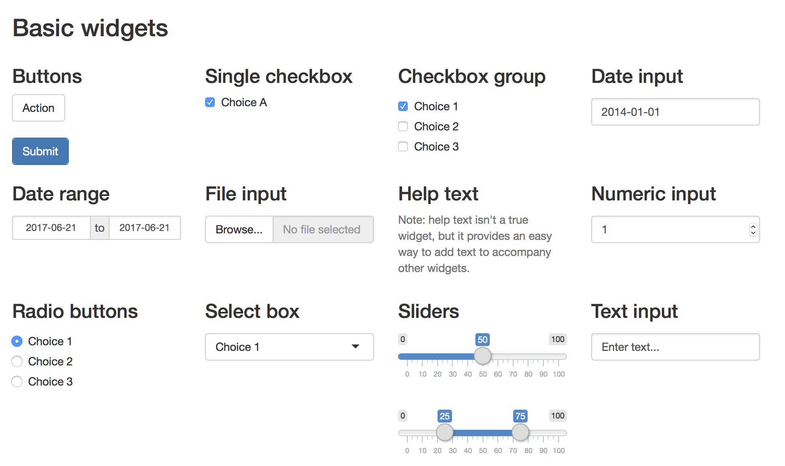

```{r setup, include=FALSE}
options(htmltools.dir.version = FALSE)
knitr::opts_chunk$set(
  fig.width = 9, fig.height = 3.5, fig.retina = 3,
  out.width = "100%",
  cache = FALSE,
  echo = TRUE,
  message = FALSE, 
  warning = FALSE,
  hiline = TRUE
)
```

```{r xaringan-themer, include = FALSE, warning = FALSE}
# load package
library(xaringanthemer)

# set accent theme
style_mono_accent(
  header_font_google = google_font("Nunito Sans"), # Sanchez
  text_font_google = google_font("Glacial Indifference", "300", "300i"),
  code_font_google = google_font("Fira Mono"),
  base_color = "#05859B",
  white_color = "#93C6C2", 
  background_color = "#FFFFFF",
  link_color = "#9b0546",
  text_bold_color = "#05859B",
  header_font_weight = 400,
  header_h1_font_size = "2.25rem",
  header_h2_font_size = "1.75rem",
  header_h3_font_size = "1.5rem",
  footnote_font_size = "0.7em",
)
```

class: inverse, middle

# An Intro to <br>

<br>

<span style = 'font-size: 130%;'>Sam Csik | Data Training Coordinator</span>  

National Center for Ecological Analysis & Synthesis<br>

<br>

<span style = 'font-size: 130%;'>Masters of Environmental Data Science | Winter 2022</span>   

Slides & source code available on [`r fontawesome::fa("github", fill = "#93C6C2", a11y = "sem")`](https://github.com/UCSB-MEDS/shiny-workshop)

---
### There are *lots* of really great Shiny resources out there

The following slides were adapted largely from existing materials, particularly: 

<span style = 'font-size: 85%;'>`r fontawesome::fa("angle-right", fill = "#05859B", a11y = "sem")` Garrett Grolemund's [Building Web Applications with Shiny](https://shiny.rstudio.com/tutorial/) tutorial (find the [GitHub Repo here](ttps://github.com/rstudio-education/shiny.rstudio.com-tutorial))</span>

<span style = 'font-size: 85%;'>`r fontawesome::fa("angle-right", fill = "#05859B", a11y = "sem")` Allison Horst's [The Basics of Building Shiny Apps in R](https://github.com/allisonhorst/shiny-basics-sb-r-ladies) workshop</span>

<br>

But there are endless other resources and tutorials to explore. Some suggested started points:

<span style = 'font-size: 85%;'>`r fontawesome::fa("angle-right", fill = "#05859B", a11y = "sem")` [Mastering Shiny](https://mastering-shiny.org/basic-app.html), by Hadley Wickham</span>

<span style = 'font-size: 85%;'>`r fontawesome::fa("angle-right", fill = "#05859B", a11y = "sem")` [Building Shiny apps - an interactive tutorial](https://deanattali.com/blog/building-shiny-apps-tutorial/), by Dean Attali</span>

<span style = 'font-size: 85%;'>`r fontawesome::fa("angle-right", fill = "#05859B", a11y = "sem")` A thoughtfully organized [Articles](https://shiny.rstudio.com/articles/) page, by Shiny and the folks at RStudio</span>

<span style = 'font-size: 85%;'>`r fontawesome::fa("angle-right", fill = "#05859B", a11y = "sem")` The [Shiny User Showcase](https://shiny.rstudio.com/gallery/#user-showcase), a collection of Shiny apps and their source code developed by the Shiny developer community -- many of these featured apps are winners or honorable mentions of the [annual Shiny contest](https://www.rstudio.com/blog/winners-of-the-3rd-annual-shiny-contest/)!</span>

<span style = 'font-size: 85%;'>`r fontawesome::fa("angle-right", fill = "#05859B", a11y = "sem")` [Shiny Demos](https://shiny.rstudio.com/gallery/#demos), a series of apps created by the Shiny developers to highlight specific features of the shiny package -- these are *excellent* resources to turn to when you are learning how to implement a new type of widget, working on the layout of your app, and more.</span>

---
class: inverse, middle, center

## What is Shiny?

---
### Shiny makes building web applications easy

> *"**Shiny is an R package that makes it easy to build interactive web apps straight from R.** You can host standalone apps on a webpage or embed them in [R Markdown](https://rmarkdown.rstudio.com/?_ga=2.5356915.1997816511.1640293283-2019993402.1637352626) documents or build [dashboards](http://rstudio.github.io/shinydashboard/?_ga=2.5356915.1997816511.1640293283-2019993402.1637352626). You can also extend your Shiny apps with [CSS themes](http://rstudio.github.io/shinythemes/?_ga=2.94499804.1997816511.1640293283-2019993402.1637352626), [htmlwidgets](http://www.htmlwidgets.org/), and JavaScript [actions.](https://github.com/daattali/shinyjs/blob/master/README.md)"* - RStudio

<br>

.center[
```{r, out.width = '80%', out.height = '80%', echo = FALSE, fig.alt = "A gif of Andre Duarte's 'Worldbank-Shiny' app. On the lefthand side of the app, the title 'Gapminder Interactive Plot' sits above a series of three widgets. The first is a dropdown menu where the user can select a region (e.g. Europe & Central Asia) or view all regions at the same time. The next two widgets are slider inputs -- the first allows the user to select a year between 1960 and 2014, and the second allows the user to select a population size between 500 and 5000. On the right hand side of the app is a bubble plot of Fertility Rate vs. Life Expectancy, which updates as inputs are changed by the user. Hovering a bubble displays thge corresponding Country, Region, Population, Life Expectancy, and Fertility Rate."}

```
.center[
<span style = 'font-size:80%;'>[Worldbank-Shiny](https://github.com/aguimaraesduarte/WorldBank-Shiny) app to visualize fertility rate vs. life expectancy from 1960 to 2015, by [Andre Duarte](https://github.com/aguimaraesduarte)</span>
]
]

---
class: inverse, middle, center

## The anatomy of a Shiny app

---
## The basic anatomy of a Shiny app

<span style = 'font-size:80%;'>Shiny apps are composed to *two parts*: (1) a **web page** that displays the app to a user (i.e. the **user interface**, or **UI** for short), and (2) a **computer** that powers the app (i.e. the **server**).</span>

.center[
```{r, out.width = '100%', out.height = '100%', echo = FALSE, fig.alt = ""}
knitr::include_graphics("media/basic_shiny_app.png")
```
]

<span style = 'font-size:80%;'>The **UI** controls the **layout and appearance** of your app and is written in HTML (except we use functions from the `{shiny}` package to write that HTML!). The **server** handles the **logic** of the app -- in other words, it is the set of instructions that tells the web page what to display when a user interacts with it.</span>
---
### Widgets are web elements that users can interact with via the UI

<span style = 'font-size:80%;'>Widgets collect information from the user that is used to update outputs created in the server.</span>

.center[
```{r, out.width = '80%', out.height = '80%', echo = FALSE, fig.alt = "Examples of Shiny's pre-built widget options. These include buttons, single checkbox, checkbox groups, date input, date range, file input, numeric input, radio buttons, select box, sliders, and text input. The default color scheme is black and gray with selections highlighted in blue."}

```
]

<span style = 'font-size:80%;'>Shiny comes with a variety of [pre-built widgets](https://shiny.rstudio.com/tutorial/written-tutorial/lesson3/) (see above), but you can also explore widget extensions using the [{shinyWidgets}](https://github.com/dreamRs/shinyWidgets) package.</span>
---
### Reactivity - a very brief intro

<span style = 'font-size:80%;'>Reactivity is what makes Shiny apps responsive i.e. it lets the app instantly update itself whenever the user makes a change. At a very basic level, it looks something like this:</span>

.center[
```{r, out.width = '90%', out.height = '90%', echo = FALSE, fig.alt = "A schematic of Shiny reactivity. (1) A widget gets information from a user which (2) is then passed to the server where it is used to update a data frame based on the users choice. (3) The new data frame is used to update outputs in the server, and (4) those outputs are then rendered in the UI."}
knitr::include_graphics("media/reactivity_intro.png")
```
]

<span style = 'font-size:80%;'>Check out Garrett Grolemund's post, [How to understand reactivity in R](https://shiny.rstudio.com/articles/understanding-reactivity.html) for a more detailed overview of Shiny reactivity.</span>

---
class: inverse, middle, center

## Can I see an example with code please?

---
### The Shiny package comes with **11** built-in examples to explore

Install (if you have not yet done so) the `{shiny}` package by running the following code in your console:
```{r install shiny, eval = FALSE}
install.packages("shiny")
```

Check out the available Shiny app examples by running this code in your console:
```{r shiny built-in example 1, eval = TRUE}
library(shiny)
runExample(example = NA)
```

Run the first example, which plots R’s built-in `faithful` data set with a configurable number of bins:
```{r, eval = FALSE}
runExample("01_hello")
```

.footnote[
Check out [The basic parts of a Shiny app](https://shiny.rstudio.com/articles/basics.html), by Shiny from RStudio for more content.
]

---
class: inverse, middle, center

## Building your first Shiny app

---
## Set up your GitHub repository & R project


---
## All Shiny apps follow the same template

<span style = 'font-size:80%;'>You can create your app using RStudio's built-in Shiny app template (e.g. File > New Project... > New Directory > Shiny Application), but it's just as easy to create it from scratch (and you'll memorize the structure faster!). Let's do that now.</span>

<span style = 'font-size:80%;'>Create a new R script and name it `app.R` -- you **must** name your script `app.R`, otherwise it will not be recognized as a Shiny app. Copy the following code into your `app.R` script.</span>

```{r, echo = TRUE, eval = FALSE}
# load packages ----
library(shiny)

# user interface ----
ui <- fluidPage()

# server instructions ----
server <- function(input, output) {}

# run the application ----
shinyApp(ui = ui, server = server)
```

<span style = 'font-size:80%;'>It is best practice to place this `app.R` file into its own folder and not in a folder that contains other scripts/files, *unless* those other files are used by your app. This is a good segue into talking about repository files structure...</span>

.footnote[
**Tip:** Use code sections (denoted by `# some text ----`) to make navigating different sections of your application code a bit easier. Code sections will appear in your document outline (find the button at the top right corner of the script/editor panel or use the `shift` + `command/control` + `O` keyboard shortcut).
]

---
## Shiny app repository structure

---
class: inverse, middle, center

## Publishing your first Shiny app

---
class: inverse, center, middle

## Troubleshooting & debugging your Shiny app

---
class: inverse, center, middle

## Additional resources

---
### Additional resources

* https://shiny.rstudio.com/images/shiny-cheatsheet.pdf
* https://github.com/daattali/shinyjs
* http://rstudio.github.io/shinythemes/
* http://rstudio.github.io/leaflet/
* https://ggvis.rstudio.com/
* https://rstudio.github.io/shinydashboard/ 
* https://deanattali.com/blog/shinydisconnect-package/
